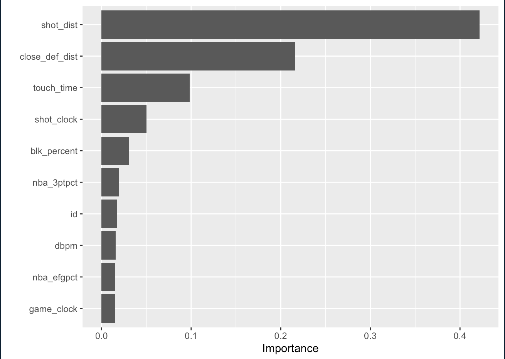

```{r setup, include=FALSE}
knitr::opts_chunk$set(echo = TRUE)
```

```{r, include=FALSE}
#Load Packages ---------------------------------------------------------------------------------
library(tidyverse)
library(skimr)
library(janitor)
library(rsample)
library(GGally)
library(glmnet)
library(modelr)
library(ranger)
library(vip)
library(pdp)
library(xgboost)
library(MASS)
library(tidyselect)

#Set the seed ----------------------------------------------------------------------------------
set.seed(3739)

#Load Data -------------------------------------------------------------------------------------
shot_logs_2015 <- read_csv("data/unprocessed/shot_logs.csv") %>%
  clean_names()
players_dat <- read_csv("data/unprocessed/players.csv") %>%
  clean_names()
defense_dat <- read_csv("data/unprocessed/NBA Season Data.csv") %>%
  clean_names()

#Data Wrangling
shot_logs_2015_updated <- shot_logs_2015 %>%
  dplyr::select(c(final_margin, shot_number, period, game_clock, shot_clock, 
           dribbles, touch_time, shot_dist, pts_type, shot_result, 
           closest_defender, close_def_dist, fgm, pts, player_name))
shot_logs_2015_updated <- shot_logs_2015_updated %>%
  mutate(closest_defender = sub("(\\w+),\\s(\\w+)","\\2 \\1", shot_logs_2015_updated$closest_defender))
players_dat <- players_dat %>%
  filter(active_to >= 2015) %>%
  dplyr::select(c(height, name, position, weight, nba_3ptpct, 
           nba_efgpct, nba_fg_percent, nba_ppg)) %>%
  rename(c("player_name" = "name")) %>%
  mutate(player_name = tolower(player_name))
defense_dat <- defense_dat %>%
  filter(year == 2015) %>%
  dplyr::select(c(player, per, stl_percent, blk_percent, dws, dws_48, dbpm, defense)) %>%
  rename(c("closest_defender" = "player"))
defense_dat <- defense_dat %>%
  group_by(closest_defender) %>% 
  transmute(
    per = mean(per),
    stl_percent = mean(stl_percent),
    blk_percent = mean(blk_percent),
    dws = sum(dws),
    dws_48 = mean(dws_48),
    dbpm = mean(dbpm),
    defense = mean(defense)
  ) %>%
  distinct(closest_defender,.keep_all = TRUE)

#Data Set Merging
nba_2015_total_dat <- merge(shot_logs_2015_updated, players_dat, by = "player_name")
nba_2015_total_dat <- merge(nba_2015_total_dat, defense_dat, by = "closest_defender")
nba_2015_total_dat <- nba_2015_total_dat %>%
  na.omit(players_dat, na.action = "omit")

#Creation of Model Building Data Set
nba_model_dat <- nba_2015_total_dat %>%
  seplyr::deselect(c("player_name", "shot_result", "closest_defender", "pts", "position", "final_margin", "id"))
nba_model_dat$height <- as_factor(nba_model_dat$height)
nba_model_dat$game_clock <- as.numeric(nba_model_dat$game_clock)
nba_model_dat %>%
  skim_without_charts()

#Data Splitting
nba_model_dat$id <- 1:nrow(nba_model_dat)
train <- nba_model_dat %>% sample_frac(.75)
test  <- anti_join(nba_model_dat, train, by = 'id')
nba_dat_split <- tibble(
  train = train %>% list(),
  test = test %>% list()
)
```

At its core, the goal of basketball is simple: try to make as many shots as you can. In the NBA as a whole, ____% of "field goals", or shot attempts, are made--but there are so many factors that effect the odds of a shot going in, including how much time is left, where on the floor the shot is taken from, how good the player shooting is, and how good the player defending the shot is. The goal of this final project is to predict whether a shot was made or missed in the NBA in order to, eventually, be able to quantify "good" and "bad" shot seletion.

I joined two data sets in order to do this project -- one data set that includes every single shot attempt form the 2015 NBA season (which includes my response variable `fgm`, a binary varaible in which 1 = a made shot and 0 = a missed shot) and another data set of NBA player statistics for the purpose of predictor variables, including offensive and defensive efficiency statistics.

<center>**Glimpse of data set**</center>
```{r, echo=FALSE}
head(nba_2015_total_dat[c(1:12)])
```

The first couple of models I trained performed poorly. I trained a linear model and a logistic model, and the linear model has an R^2 value of 0.00126 and the logistic model has a 0.608 test accuracy.

<center>**Simple linear model with dribbles and closest defender distance as predictors**</center>
```{r, include=FALSE}
lm_fit_1 <- nba_model_dat %>% lm(formula = fgm ~ dribbles + close_def_dist)
```

```{r, echo=FALSE}
lm_fit_1 %>%
  broom::glance()
modelr::mse(lm_fit_1, nba_model_dat)
```

```{r, include=FALSE}
glm_fits_2 <- nba_dat_split %>% 
  mutate(mod_01 = map(train, glm, 
                      formula = fgm ~ close_def_dist + shot_dist + touch_time + shot_clock + dbpm + nba_efgpct,
                      family = binomial))

glm_fits_2 %>% 
  pluck("mod_01", 1) %>% 
  tidy()

glm_fits_2 %>% 
  pluck("mod_01", 1) %>% 
  predict(type = "response") %>% 
  skim_without_charts()

demo_tib_2 <- glm_fits_2 %>%
  mutate(train_prob = map(mod_01, predict, type = "response"),
         train_direction = map(train_prob, ~ if_else(.x > 0.5, 1, 0)))

demo_tib_2 %>% 
  unnest(cols = c(train, train_direction)) %>% 
  count(train_direction) %>% 
  mutate(prop = n / sum(n))

demo_tib_2 %>% 
  unnest(cols = c(train, train_direction)) %>% 
  count(fgm, train_direction) %>% 
  mutate(prop = n / sum(n)) %>% 
  arrange(desc(fgm))

demo_tib_2 %>% 
  unnest(cols = c(train, train_direction)) %>% 
  mutate(correct = if_else(train_direction == fgm, 1, 0)) %>% 
  summarise(train_accuracy = mean(correct),
            train_error = 1 - train_accuracy)

demo_tib_2 <- demo_tib_2 %>%
  mutate(test_prob = map2(mod_01, test, predict, type = "response"),
         test_direction = map(test_prob, ~ if_else(.x > 0.5, 1, 0)))

demo_tib_2 %>% 
  unnest(cols = c(test, test_direction)) %>% 
  mutate(correct = if_else(test_direction == fgm, 1, 0)) %>% 
  summarise(test_accuracy = mean(correct),
            test_error = 1 - test_accuracy)
```

<center>**Logistic model with closest defender distance, shot distance, touch time, shot clock time remaining, dbpm, and efg% as predictors**</center>
```{r, echo=FALSE}
glm_fits_2 %>% 
  pluck("mod_01", 1) %>% 
  tidy()

demo_tib_2 %>% 
  unnest(cols = c(train, train_direction)) %>% 
  count(fgm, train_direction) %>% 
  mutate(prop = n / sum(n)) %>% 
  arrange(desc(fgm))

demo_tib_2 %>% 
  unnest(cols = c(test, test_direction)) %>% 
  mutate(correct = if_else(test_direction == fgm, 1, 0)) %>% 
  summarise(test_accuracy = mean(correct),
            test_error = 1 - test_accuracy)
```

I then trained a random forest, and the results were slightly better. Here is the plot of test, training, and OOB error rates, which led me to picking an mtry of 5 for the tuned forest.


Finally, I trained six different classes of boosted models, varying the `depth` and `nrounds` tuning parameters each time, until I landed on my best model, a boosted model with depth = 5, nrounds = 50, and a learning rate of 0.08.


Also of note, a simple bar plot of variable importance shows that ten most "important" predictors are shot distance, closest defender distance, touch time, shot clock time remaining, closest defender block percentage, three point shooting percentage, player ID, defensive box plus minus, effective field goal percentage, and game clock time remaining.



This final boosted model has the lowest misclass error (0.3758039) and therefore best test accuracy (0.6241961) of all the models I trained, so that is how I decided on using it as my final model.

My final model proves that shot selection (distance from the hoop and how open the offensive player is) matters more than defender defensive ability when it comes to making versus missing a shot--which is good to know when designing basketball offensive game plans.

My next possible steps include training even more complex and sophisticated models in order to improve my prediction ability even more, and then going back into the data and using player tracking data to begin qualifying "good" and "bad" shots in the moment of the game, and what "better" shots were possibly available for the offensive player. This high-level analysis can eventually lead to the ability to quantify offensive decision making in the NBA, which will help GMs assemble winning rosters and make smarter decisions in free agency and the draft.